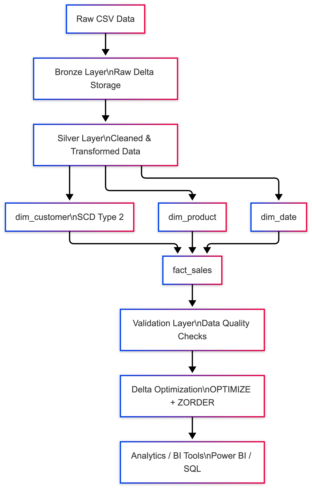
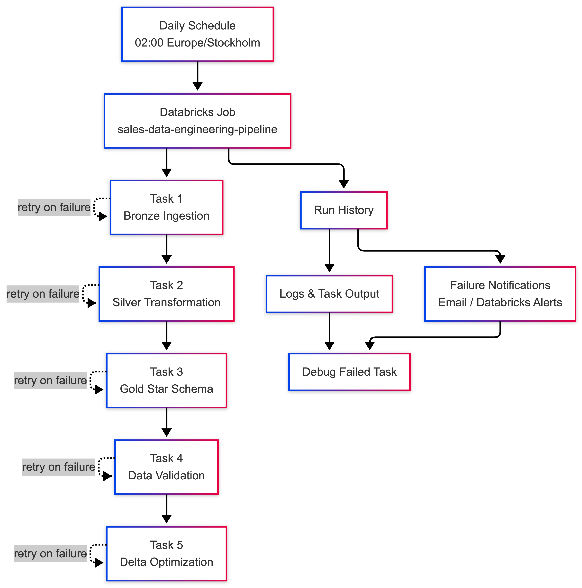

# 🚀 Sales Data Engineering Pipeline


---

## 📌 Project Overview

This project demonstrates an **end-to-end data engineering pipeline** using PySpark, Delta Lake, and Databricks.

It transforms raw sales data into an analytics-ready data model using:

- Medallion Architecture (Bronze / Silver / Gold)
- Star Schema
- Slowly Changing Dimension Type 2 (SCD2)
- Data validation and quality checks
- Delta optimization techniques

---

## 🏗️ Architecture



## Databricks Workflow Diagram



### Workflow Features

- Multi-task Databricks Job
- Daily scheduled execution
- Task dependencies
- Retry policy for failed tasks
- Run history monitoring
- Logs and task output inspection
- Failure notifications

### Recommended Job Settings

```text
Schedule: Daily at 02:00 Europe/Stockholm
Retries: 2
Retry interval: 5 minutes
Monitoring: Run history + task logs + failure notifications
```

## 🧱 Tech Stack

Python
PySpark
Delta Lake
Databricks Workflows
PyTest
Git / GitHub

## 📂 Repository Structure

```text
sales-data-engineering-project/
├── data/
│ └── raw/
│ └── sales_raw.csv
├── notebooks/
│ ├── 01_bronze_ingestion.py
│ ├── 02_silver_transformation.py
│ ├── 03_gold_star_schema.py
│ ├── 04_validation.py
│ └── 05_delta_optimization.py
├── src/
│ ├── config.py
│ └── utils.py
├── jobs/
│ └── databricks_job_config.json
├── docs/
│ └── architecture.md
├── tests/
│ └── test_data_quality.py
├── README.md
├── requirements.txt
└── .gitignore
```

## ⚙️ Configuration Management

All paths and pipeline configurations are centralized in:

src/config.py

Example:
```text
from src.config import Paths
paths = Paths()
print(paths.SILVER_SALES_PATH)
```

Benefits:
- No hardcoded paths
- Easy environment changes
- Clean and maintainable code

## 🧩 Reusable Utilities

Common operations are abstracted into:

src/utils.py

Includes:
- Delta read/write helpers
- Data validation functions
- Logging utilities
- 
Example:
```Python
from src.utils import read_delta, write_delta
df = read_delta(spark, path)
write_delta(df, path)
```

## 🥉 Bronze Layer

Purpose:
- Store raw data
- Preserve source format
- Convert CSV → Delta

Output:

data/bronze/sales_raw

## 🥈 Silver Layer

Transformations:
- Type casting (string → int/double/date)
- Date parsing
- Deduplication (Window Function)
- Data validation
- Feature engineering (total_amount)
- Deduplication Strategy:
- Partition by: order_id, product_id  
- Order by: ingestion_time DESC
- Validation Rules:
- Required fields must not be null
- Quantity and price must be positive

## 🥇 Gold Layer (Star Schema)

Fact Table:
- fact_sales
- Dimension Tables:
- dim_customer (SCD Type 2)
- dim_product
- dim_date

## 🔄 Slowly Changing Dimension Type 2 (SCD2)

dim_customer tracks historical changes:

Columns:
- start_date
- end_date
- is_current

Behavior:
- New customer → Insert
- Changed customer → Expire old + Insert new
- Unchanged → Keep existing

🔗 Fact Table Join Strategy

Currently:

Join on latest version (is_current = true)

Production-ready extension:

Time-based join using start_date / end_date

## ✅ Data Validation

Validation layer ensures data quality:

Checks:
- Row count consistency (Silver vs Fact)
- Null foreign keys
- Dimension uniqueness
- SCD Type 2 correctness

Failures stop the pipeline execution.

## ⚡ Delta Optimization

Techniques used:
- Partitioning (date_key)
- OPTIMIZE (file compaction)
- ZORDER (query performance)

Example:
OPTIMIZE delta.`data/gold/fact_sales`
ZORDER BY (product_key, customer_key);

## 🔁 Databricks Workflow

Bronze → Silver → Gold → Validation → Optimization

Schedule:

Daily at 02:00 Europe/Stockholm

Retry Policy:
- 2 retries
- 5 minutes interval

## ▶️ How to Run

### 1. Install dependencies
```bash
pip install -r requirements.txt
```

## 🧪 Testing

Basic data quality tests implemented with PyTest.

Includes:
- Schema validation
- Null checks
- Positive value checks
- Duplicate detection

Run tests:
```python
pytest tests/
```

## 🧠 Design Principles
- Medallion Architecture
- Separation of concerns
- Config-driven pipeline
- Reusable components
- Data quality first approach
- Scalable modeling (Star Schema + SCD2)

## ⚠️ Notes

- Delta OPTIMIZE and ZORDER require Databricks Runtime
- Local Spark may not support all optimization features

## 🚀 Performance Optimization

This project applies several Spark and Delta Lake optimization techniques to improve performance, scalability, and cost efficiency.

---

### ⚡ Spark Optimization Techniques

#### 1. Column Pruning

Only required columns are selected during transformations to reduce I/O and memory usage.

```python
df.select("order_id", "customer_id", "product_id")
```

#### 2. Filter Pushdown

Filters are applied as early as possible to minimize data processing.

df.filter(col("order_date") >= "2026-01-01")

#### 3. Broadcast Joins

Dimension tables are broadcasted to avoid expensive shuffles during joins.

```python
from pyspark.sql.functions import broadcast

fact_sales = fact_base.join(
broadcast(dim_product),
"product_id"
)
```

#### 4. Partition Management

Data is partitioned to enable parallel processing and efficient querying.

```python
fact_sales.write.partitionBy("date_key")
```

#### 5. Avoiding collect()

Large datasets are never collected to the driver to prevent memory issues.

Instead, aggregation and sampling are used:

```python
df.groupBy("country").count().show()
```

### 🔁 Shuffle Optimization

Operations that trigger shuffle are minimized:

- groupBy
- join
- distinct
- orderBy

Where possible:

- Broadcast joins are used
- Data is filtered before joins
- Partitioning is optimized

### 🧠 Adaptive Query Execution (AQE)

Spark AQE is leveraged to optimize execution dynamically:

- Adjusts shuffle partitions
- Optimizes join strategies
- Handles skewed data

### 📦 Delta Lake Optimization

#### 1. File Compaction (OPTIMIZE)

Reduces small file problem:

```python
OPTIMIZE delta.`data/gold/fact_sales`;
```

#### 2. Z-Ordering

Improves query performance for frequently filtered columns:

```python
OPTIMIZE delta.`data/gold/fact_sales`
ZORDER BY (product_key, customer_key);
```

#### 3. Partitioning Strategy

Fact table is partitioned by:

date_key

This improves performance for time-based queries.

## ⚠️ Performance Considerations

- Over-partitioning can degrade performance
- Excessive OPTIMIZE operations increase compute cost
- Broadcast joins should only be used for small tables
- Skewed data can impact performance if not handled

## 🔮 Future Improvements
- Incremental processing (CDC / streaming)
- CI/CD pipeline (GitHub Actions)
- Data catalog integration (Unity Catalog / Glue)
- BI dashboard integration (Power BI / Tableau)

## 🎯 Outcome

These optimizations ensure:
- Faster query execution
- Reduced cluster resource usage
- Improved scalability for large datasets
